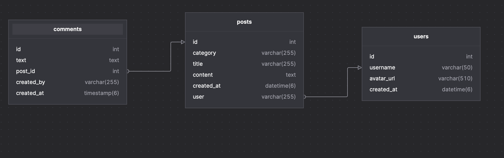

## Installation & Test Setup

## Installation & Test Setup

1. Clone repository:
   ```bash
   git clone https://github.com/kasidit-wansudon/board_backend
   cd board_backend
   ```
2. Set DB:
   ```bash
   src/app.module.ts:16
   เข้าไป Set Connect เมื่อ Run Projec -> Auto Create Table 
   ```
3. Install dependencies:
   ```bash
   npm install
   # or
   yarn install
   # or
   pnpm install
   ```
4. Start development server:
   ```bash
   npm start:dev
   # or
   pnpm start:dev
   ```
5. Run unit tests:
   ```bash
   ไม่ได้ทำครับ ใช้แค่ swagger
   http://[::1]:30001/api
   ```
   set .ENV

```
PORT=30001
```

## Application Architecture

- **NestJS** เป็น framework หลัก
- **TypeORM + MySQL** สำหรับ ORM/Database
- **DTO + Validation** ใช้ `class-validator` + `class-transformer`
- **Swagger** สำหรับ document API

## Libraries & Packages

- `@nestjs/common`, `@nestjs/core` – Core ของ NestJS
- `@nestjs/typeorm`, `typeorm` – ORM
- `mysql2` – MySQL driver
- `class-validator`, `class-transformer` – DTO validation
- `@nestjs/swagger`, `swagger-ui-express` – API documentation
- `jest`, `@nestjs/testing` – Unit testing

### comments

| Column     | Type         | Description                 |
| ---------- | ------------ | --------------------------- |
| id         | int          | Primary key, auto-increment |
| text       | text         | เนื้อหาของคอมเมนต์          |
| post_id    | int          | Foreign key → posts.id      |
| created_by | varchar(255) | Username ผู้สร้างคอมเมนต์   |
| created_at | timestamp    | เวลาที่สร้าง (auto)         |

### posts

| Column     | Type         | Description                         |
| ---------- | ------------ | ----------------------------------- |
| id         | int          | Primary key, auto-increment         |
| category   | varchar(255) | หมวดหมู่โพสต์                       |
| title      | varchar(255) | หัวข้อโพสต์                         |
| content    | text         | เนื้อหาของโพสต์                     |
| created_at | datetime     | เวลาที่สร้าง (auto)                 |
| user       | varchar(255) | Username ผู้สร้างโพสต์ (FK → users) |

### users

| Column     | Type         | Description                 |
| ---------- | ------------ | --------------------------- |
| id         | int          | Primary key, auto-increment |
| username   | varchar(50)  | ชื่อผู้ใช้งาน (unique)      |
| avatar_url | varchar(510) | URL รูปโปรไฟล์              |
| created_at | datetime     | เวลาที่สร้างบัญชี (auto)    |


